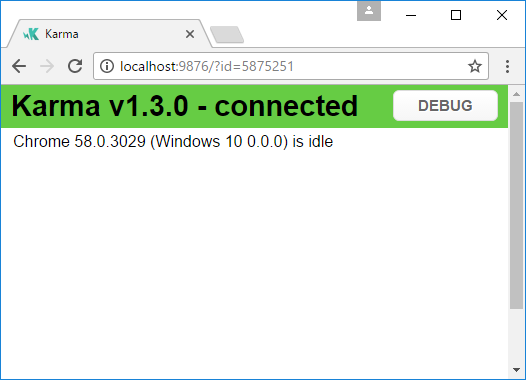
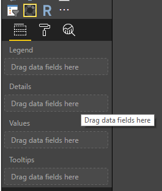
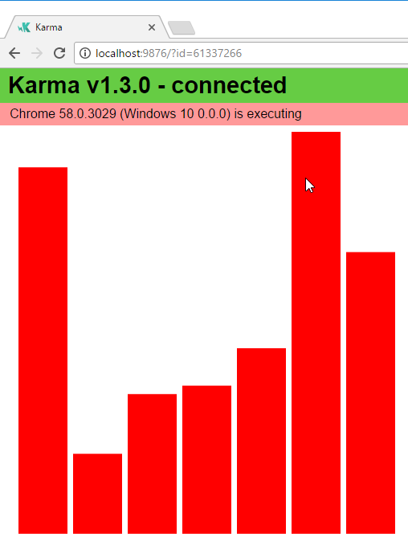
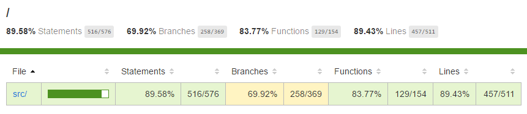
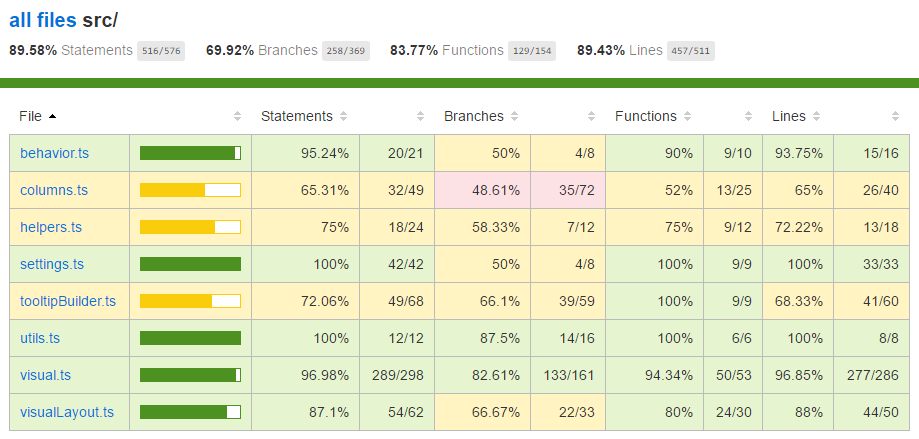
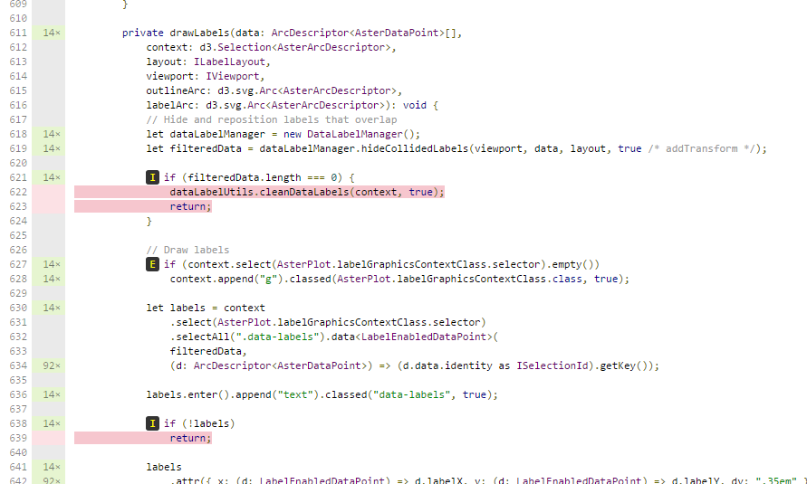

# Custom visuals unit test

This tutorial will describe basics of writing unit tests for your custom visuals. In this tutorial, we will consider how to use test runner karma.js, testing framework. - jasmine.js and also we will consider how to use powerbi-visuals-utils-testutils package. It is a set of mocks and fakes to simplify unit testing for Power BI custom visuals.

## Install and configure karma.js and jasmine

Add required libraries into package.json at `devDependencies` section:

```json
"@types/jasmine": "2.5.37",
"@types/jasmine-jquery": "1.5.28",
"coveralls": "2.11.15",
"jasmine": "2.5.2",
"jasmine-jquery": "2.1.1",
"karma": "1.3.0",
"karma-chrome-launcher": "2.0.0",
"karma-coverage": "1.1.1",
"karma-jasmine": "1.0.2",
"karma-remap-istanbul": "0.4.0",
"karma-sourcemap-loader": "0.3.7",
"karma-typescript-preprocessor": "0.3.0"
```

A purpose of each them described below.

Save `package.json` and execute on command line at `package.json` location:

```
npm install
```

Package manager will install all new packages added into `package.json`

For running unit test we will need to configure runner. The sample of config you can find here 

```js
'use strict';

const recursivePathToTests = 'test/**/*.ts'
    , srcRecursivePath = '.tmp/drop/visual.js'
    , srcCssRecursivePath = '.tmp/drop/visual.css'
    , srcOriginalRecursivePath = 'src/**/*.ts'
    , coverageFolder = 'coverage';

module.exports = (config) => {
    const browsers = [];

    if (process.env.TRAVIS) {
        browsers.push('ChromeTravisCI');
    } else {
        browsers.push('Chrome');
    }

    config.set({
        browsers,
        customLaunchers: {
            ChromeTravisCI: {
                base: 'Chrome',
                flags: ['--no-sandbox']
            }
        },
        colors: true,
        frameworks: ['jasmine'],
        reporters: [
            'progress',
            'coverage',
            'karma-remap-istanbul'
        ],
        singleRun: false,
        files: [
            {
                pattern: 'data/*.csv',
                watched: true,
                served:  true,
                included: false
            },
            srcCssRecursivePath,
            srcRecursivePath,
            'node_modules/jquery/dist/jquery.min.js',
            'node_modules/jasmine-jquery/lib/jasmine-jquery.js',
            'node_modules/powerbi-visuals-utils-testutils/lib/index.js',
            recursivePathToTests,
            {
                pattern: srcOriginalRecursivePath,
                included: false,
                served: true
            }
        ],
        preprocessors: {
            [recursivePathToTests]: ['typescript'],
            [srcRecursivePath]: ['sourcemap', 'coverage']
        },
        typescriptPreprocessor: {
            options: {
                sourceMap: false,
                target: 'ES5',
                removeComments: false,
                concatenateOutput: false
            }
        },
        coverageReporter: {
            dir: coverageFolder,
            reporters: [
                { type: 'html' },
                { type: 'lcov' }
            ]
        },
        remapIstanbulReporter: {
            reports: {
                lcovonly: coverageFolder + '/lcov.info',
                html: coverageFolder,
                'text-summary': null
            }
        }
    });
};
```

You can modify this configuration late if it is required.

Some settings of `karma.conf.js`:

* `recursivePathToTests` variable locates place of code of tests

* `srcRecursivePath` varibale locates output JS code after compilling

* `srcCssRecursivePath` varibale locates output CSS after compilling less file with styles.

* `srcOriginalRecursivePath` variable locates source code of your visual

* `coverageFolder` - variable determines a place where the report of coverage will create.

Some properties of config:

* `singleRun: true` - test usually run in CI system. And it is enough to single one time. 
You can change to `false` for debugging your tests. Karma will keep running browser, and it will allow you use the console to debug.

* `files: [...]` - in this array, you can set files for loading to the browser.
Usually, there are source files, test cases, libraries (jasmine, test utils). You can add to list other files if you need.

* `preprocessors` - this section of config you configure actions, which will do before tests will run. There are precompiling of typescript to JS and preparing sourcemap files and generating code coverage report. You can disable `coverage` for debugging your tests. Coverage generates additional code for check code for the test covering and it will complicate debugging tests. 

Description of configurations you can find in the documentation of karma.js:
https://karma-runner.github.io/1.0/config/configuration-file.html

To convenient use, you can add test command in `scripts` section of `package.json`.

```json
"scripts": {
        "postinstall": "pbiviz update 1.5.0",
        "pbiviz": "pbiviz",
        "start": "pbiviz start",
        "typings":"node node_modules/typings/dist/bin.js i",
        "lint": "tslint -r \"node_modules/tslint-microsoft-contrib\"  \"+(src|test)/**/*.ts\"",
        "pretest": "pbiviz package --resources --no-minify --no-pbiviz --no-plugin",
        "test": "karma start"
    },
```

Next step is adding references to jasmine framework, powerbi-visuals-utils-testutils, jquery and other libs.

Create `test` folder at the root of the project with `_references.ts` file. This file will contain references to typings and source code of unit tests:

```xml
// External
/// <reference path="../node_modules/@types/jquery/index.d.ts" />
/// <reference path="../node_modules/@types/jasmine/index.d.ts" />
/// <reference path="../node_modules/@types/jasmine-jquery/index.d.ts" />

// Power BI API
/// <reference path="../.api/v1.5.0/PowerBI-visuals.d.ts" />

// Power BI Extensibility
/// <reference path="../node_modules/powerbi-visuals-utils-testutils/lib/index.d.ts"/>

// The visual
/// <reference path="../.tmp/drop/visual.d.ts" />

// Test
/// <reference path="visualBuilder.ts" />
```

So, you are ready to begin writing your unit test.

## Simple unite test for check DOM element of visual.

For testing visual, we must create an instance of visual. 

Add `visualBuilder.ts` file into `test` folder with next code:

```ts
/// <reference path="_references.ts"/>

module powerbi.extensibility.visual.test {
    // powerbi.extensibility.utils.test
    import VisualBuilderBase = powerbi.extensibility.utils.test.VisualBuilderBase;

    // PBI_CV_9894B302_1DFF_4A96_ABFE_BF8588197166
    import VisualClass = powerbi.extensibility.visual.PBI_CV_9894B302_1DFF_4A96_ABFE_BF8588197166.BarChart;

    export class BarChartBuilder extends VisualBuilderBase<VisualClass> {
        constructor(width: number, height: number) {
            super(width, height);
        }

        protected build(options: VisualConstructorOptions) {
            return new VisualClass(options);
        }

        public get mainElement() {
            debugger;
            return this.element.children("svg.barChart");
        }
    }
}
```

There `PBI_CV_9894B302_1DFF_4A96_ABFE_BF8588197166` is guid of visual. You visual guid must be different.

There is `build` method for creating an instance of our visual. `mainElement` is a get method which returns an instance of "root" DOM element in our visual. The method is optional, but it convenient in writing unit test.

So, we have the builder of an instance of visual. Let's write the test case. It will be a simple test case to check that SVG element created when our visual displays.

Add `visualTest.ts` file for test cases with next code:

```ts
/// <reference path="_references.ts"/>

module powerbi.extensibility.visual.test {
    // powerbi.extensibility.visual.test
    import VisualBuilder = powerbi.extensibility.visual.test.BarChartBuilder;

    describe("BarChart", () => {
        let visualBuilder: VisualBuilder;
        let dataView: DataView;

        beforeEach(() => {
            visualBuilder = new VisualBuilder(500, 500);
        });

        it("root DOM element is created", () => {
            expect(visualBuilder.mainElement).toBeInDOM();
        });
    });
}
```

There are calling of several methods.

* [`describe`](https://jasmine.github.io/api/2.6/global.html#describe) method describes test case. In a context of jasmine framework often called suite or group of specs.

* `beforeEach` method will be call before each call of `it` method, which defined inside of [`describe`](https://jasmine.github.io/api/2.6/global.html#beforeEach) method. 

* `it` defines a single spec. [`it`](https://jasmine.github.io/api/2.6/global.html#it) method should contain one or more `expectations`.

* [`expect`](https://jasmine.github.io/api/2.6/global.html#expect) - method creates expectation for a spec. A spec will succeed if will be passing all expectations and a spec with any failures of expectations will fail.

* `toBeInDOM` - it's one of matchers method. About exists matchers you can read in [documentation](https://jasmine.github.io/api/2.6/matchers.html) of jasmine framework.

After that, you can run your simple unit test by type command in command line.

This test will check that root SVG element will create when visuals create.

To run the unit test, you can type in the command line.

```
npm run test 
```

karma.js will run chrome browser and will execute test case.



In command line you will get next output:

```
> karma start

23 05 2017 12:24:26.842:WARN [watcher]: Pattern "E:/WORKSPACE/PowerBI/PowerBI-visuals-sampleBarChart/data/*.csv" does not match any file.
23 05 2017 12:24:30.836:WARN [karma]: No captured browser, open http://localhost:9876/
23 05 2017 12:24:30.849:INFO [karma]: Karma v1.3.0 server started at http://localhost:9876/
23 05 2017 12:24:30.850:INFO [launcher]: Launching browser Chrome with unlimited concurrency
23 05 2017 12:24:31.059:INFO [launcher]: Starting browser Chrome
23 05 2017 12:24:33.160:INFO [Chrome 58.0.3029 (Windows 10 0.0.0)]: Connected on socket /#2meR6hjXFmsE_fjiAAAA with id 5875251
Chrome 58.0.3029 (Windows 10 0.0.0): Executed 1 of 1 SUCCESS (0.194 secs / 0.011 secs)

=============================== Coverage summary ===============================
Statements   : 27.43% ( 65/237 )
Branches     : 19.84% ( 25/126 )
Functions    : 43.86% ( 25/57 )
Lines        : 20.85% ( 44/211 )
================================================================================
```

You will agree that it isn't very useful test. The visual visualizes data.  

## How to add static data for unit tests

Create `visualData.ts` file in `test`folder. With next code:

```ts
/// <reference path="_references.ts"/>

module powerbi.extensibility.visual.test {
    import CustomizeColumnFn = powerbi.extensibility.utils.test.dataViewBuilder.CustomizeColumnFn;
    import TestDataViewBuilder = powerbi.extensibility.utils.test.dataViewBuilder.TestDataViewBuilder;

    export class SampleBarChartDataBuilder extends TestDataViewBuilder {
        public static CategoryColumn: string = "category";
        public static MeasureColumn: string = "measure";

        public constructor() {
            super();
            ...
        }

        public getDataView(columnNames?: string[], customizeColumns?: CustomizeColumnFn): DataView {
            let dateView: any = this.createCategoricalDataViewBuilder([
                ...
            ],
            [
                ...
            ], columnNames).build();

            //there is client side computed maxValue
            let maxLocal = 0;
            this.valuesMeasure.forEach((item) => {
                 if (item > maxLocal) {
                     maxLocal = item;
                 }
            });
            (<any>dataView).categorical.values[0].maxLocal = maxLocal;
        }
    }
}
```

The `SampleBarChartDataBuilder` class extends `TestDataViewBuilder` and relizes abstract method `getDataView`.

When you put data to buckets in `Fields` panel PowerBI will produce you the categorical dataview based on your data.



In unit tests, you don't have PowerBI core functions to reproduce it. But you need map your static data to categorical dataview. And `TestDataViewBuilder` class will help you in it.

[Read more about DataViewMapping](https://github.com/Microsoft/PowerBI-visuals/blob/master/Capabilities/DataViewMappings.md)

In `getDataView` method you just call `createCategoricalDataViewBuilder` method with your data.

In `sampleBarChart` visual [capabilities.json](https://github.com/Microsoft/PowerBI-visuals-sampleBarChart/blob/master/capabilities.json#L2) we have a dataRoles and dataViewMapping described below

```json
"dataRoles": [
    {
        "displayName": "Category Data",
        "name": "category",
        "kind": "Grouping"
    },
    {
        "displayName": "Measure Data",
        "name": "measure",
        "kind": "Measure"
    }
],
"dataViewMappings": [
    {
        "conditions": [
            {
                "category": {
                    "max": 1
                },
                "measure": {
                    "max": 1
                }
            }
        ],
        "categorical": {
            "categories": {
                "for": {
                    "in": "category"
                }
            },
            "values": {
                "select": [
                    {
                        "bind": {
                            "to": "measure"
                        }
                    }
                ]
            }
        }
    }
],
```

To generate the same mapping you must set following params to `createCategoricalDataViewBuilder` method:

```js
[
    {
        source: {
            displayName: "Category",
            queryName: SampleBarChartData.ColumnCategory,
            type: ValueType.fromDescriptor({ text: true }),
            roles: {
                Category: true
            },
        },
        values: this.valuesCategory
    }
], [
    {
        source: {
            displayName: "Measure",
            isMeasure: true,
            queryName: SampleBarChartData.MeasureColumn,
            type: ValueType.fromDescriptor({ numeric: true }),
            roles: {
                Measure: true
            },
        },
        values: this.valuesMeasure
    },
], columnNames
```

Where `this.valuesCategory` array of categories.

```ts
public valuesCategory: string[] = ["Monday", "Tuesday", "Wednesday", "Thursday", "Friday", "Saturday", "Sunday"];
```

and `this.valuesMeasure` array of measure for each category. Example:

```ts
public valuesMeasure: number[] = [742731.43, 162066.43, 283085.78, 300263.49, 376074.57, 814724.34, 570921.34];
```

Now, you can use `SampleBarChartDataBuilder` class in your unit test.

`ValueType` class defined in `powerbi-visuals-utils-testutils` package. And 
`createCategoricalDataViewBuilder` method requires `lodash` library.

You need add thes packages to dependencies

In `package.json` at `devDependencies` section
```json
"lodash": "4.16.2",
"powerbi-visuals-utils-testutils": "0.2.2"
```

In `karma.conf.js` at `files` section
```js
'node_modules/lodash/lodash.min.js',
'node_modules/powerbi-visuals-utils-typeutils/lib/index.js',
```

In `test\_references.ts` file at `Power BI Extensibility` section

```xml
/// <reference path="../node_modules/powerbi-visuals-utils-typeutils/lib/index.d.ts"/>
```

You will need call 
```
npm install 
```

to install `lodash` library.

Now, you can run unit test again. You must get next output

```
> karma start

23 05 2017 16:19:54.318:WARN [watcher]: Pattern "E:/WORKSPACE/PowerBI/PowerBI-visuals-sampleBarChart/data/*.csv" does not match any file.
23 05 2017 16:19:58.333:WARN [karma]: No captured browser, open http://localhost:9876/
23 05 2017 16:19:58.346:INFO [karma]: Karma v1.3.0 server started at http://localhost:9876/
23 05 2017 16:19:58.346:INFO [launcher]: Launching browser Chrome with unlimited concurrency
23 05 2017 16:19:58.394:INFO [launcher]: Starting browser Chrome
23 05 2017 16:19:59.873:INFO [Chrome 58.0.3029 (Windows 10 0.0.0)]: Connected on socket /#NcNTAGH9hWfGMCuEAAAA with id 3551106
Chrome 58.0.3029 (Windows 10 0.0.0): Executed 1 of 1 SUCCESS (1.266 secs / 1.052 secs)

=============================== Coverage summary ===============================
Statements   : 56.72% ( 135/238 )
Branches     : 32.54% ( 41/126 )
Functions    : 66.67% ( 38/57 )
Lines        : 52.83% ( 112/212 )
================================================================================
```

And you must see started Chrome Browser with your visual



Make attention coverage summary increased. For more details and analyze code coverage you can open `coverage\index.html` by browser.



Or in scope of `src` folder



In the scope of file, you can look source code. `Coverage` utils would mark row background to red if a code were not executed during running of unit tests.



But code coverage doesn't mean that you have good functionality coverage of visual. One simple unit test provided over 96% of coverage in `src\visual.ts`.

## 